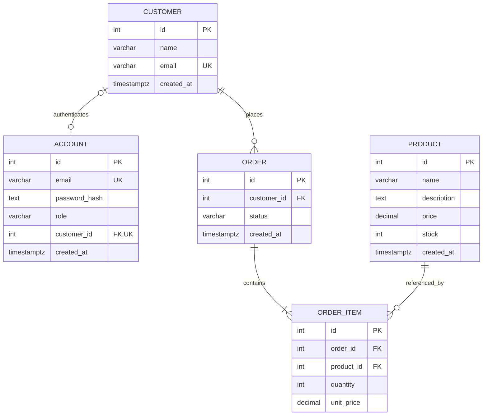

# API Design

## Implementation status

As of 4 October 2026, `GET /health`, `POST /auth/register`, and `POST /auth/login` are implemented. Token verification middleware is ready for future protected routes. Shared validation and JSON error middleware are ready for business routes. The contracts below guide the remaining daily work.

## Entity relationship diagram



The five entities above match the current Prisma schema. An order must contain at least one item at the API level; foreign keys alone do not enforce that minimum. Email is unique; prices and stock are nonnegative; quantity is positive. Money uses `NUMERIC(12,2)` and JSON decimal strings. Timestamps use UTC ISO 8601; JSON fields use camelCase.

Current database deletion rules cascade customer deletion to orders and order deletion to items; referenced products cannot be deleted. Planned API rules preserve order history: customer deletion with existing orders returns 409, and there is no order-delete endpoint. The customer route must enforce this transactionally despite the existing cascade (or introduce a reviewed restrictive migration).

Implemented on 4 October: a separate Account model with unique email, passwordHash, role (`customer` or `staff`), and an optional unique customerId foreign key. Customer accounts require a linked customer; staff may be unlinked. Registration creates both records transactionally. Password hashes never appear in responses. Customer email changes must synchronize the account email transactionally. Customer deletion must also remove its linked login account.

## Authentication and access rules

Implemented authentication uses signed, expiring HS256 JWT bearer tokens in `Authorization: Bearer <token>`. Verify signature and expiry, then load the account and permissions from storage. Missing, invalid, or expired credentials return 401. Staff accounts are provisioned administratively; public requests cannot assign roles. Tokens expire after one hour and require JWT_SECRET (at least 32 bytes), the fixed issuer backend-module-rest-api and audience backend-module-clients. See README for setup.

| Method | Path | Access and purpose | Success |
|---|---|---|---|
| GET | `/health` | Public database connectivity check | 200 or 503 |
| POST | `/auth/register` | Public; create customer account | 201 |
| POST | `/auth/login` | Public; authenticate | 200 |
| GET | `/customers` | Staff; list customers | 200 |
| POST | `/customers` | Staff; create customer profile without login | 201 |
| GET | `/customers/:id` | Staff or matching customer | 200 |
| PATCH | `/customers/:id` | Staff or matching customer; name/email only | 200 |
| DELETE | `/customers/:id` | Staff; only customers without orders | 204 |
| GET | `/products` | Public; list/search products | 200 |
| GET | `/products/:id` | Public; product detail | 200 |
| POST | `/products` | Staff; create product | 201 |
| PATCH | `/products/:id` | Staff; update product | 200 |
| DELETE | `/products/:id` | Staff; only unreferenced products | 204 |
| GET | `/orders` | Customer sees own orders; staff sees all | 200 |
| POST | `/orders` | Customer; create own order | 201 |
| GET | `/orders/:id` | Owning customer or staff | 200 |
| PATCH | `/orders/:id/status` | Staff; allowed transition only | 200 |

Return 404 for another customer's customer/order detail to avoid revealing its existence. Return 403 for a role-prohibited action. Route IDs are positive PostgreSQL integers. Reject unknown body/query fields, invalid types and empty PATCH bodies. Trim names and normalize emails to lowercase; never trim passwords. Names must fit schema lengths; emails must be valid and at most 255 characters. Passwords are 12–128 characters. Product descriptions are at most 5000 characters; stock and quantities are integers within PostgreSQL integer bounds. Decimal prices have at most ten integer digits and two fractional digits.

Planned for 9 October: lists accept `page` (default 1) and `limit` (default 20, maximum 100), return stable ascending ID order and `{data: [...], pagination: {page, limit, total}}`. Product search uses `search` (1–160 characters); orders accept `status` from the allowed enum. Reject malformed or repeated query parameters. Apply ownership filtering before pagination and counting.

## Request and response examples (accounts implemented; business routes planned)

All write bodies use `Content-Type: application/json`. Resource creation returns a Location header; 204 responses have no body. Single-resource responses use `data`; authentication uses the explicit envelopes below.

### Accounts

`POST /auth/register`:
```json
{"name":"Ada","email":"ada@example.com","password":"example-password-only"}
```
201, `Location: /customers/1`:
```json
{"data":{"id":1,"name":"Ada","email":"ada@example.com","createdAt":"2026-10-04T08:00:00.000Z"}}
```
`POST /auth/login` with the same email and password returns 200:
```json
{"accessToken":"<signed-token>","tokenType":"Bearer","expiresIn":3600}
```
Duplicate email returns 409; wrong email or password returns the same 401 `Invalid credentials` error.

### Customers

Staff `POST /customers` accepts `{"name":"Ada","email":"ada@example.com"}` and returns 201 with the same customer envelope as registration. `PATCH /customers/1` accepts `{"name":"Ada Lovelace"}` and returns the updated customer envelope. `GET /customers/1` returns that envelope. `GET /customers` returns:
```json
{"data":[{"id":1,"name":"Ada","email":"ada@example.com","createdAt":"2026-10-04T08:00:00.000Z"}],"pagination":{"page":1,"limit":20,"total":1}}
```
Deleting a customer with orders returns 409 `Customer has orders`; otherwise staff deletion returns empty 204.

### Products

Staff `POST /products`:
```json
{"name":"Notebook","description":"A5 paper notebook","price":"12.34","stock":5}
```
201, `Location: /products/1` (also the GET detail envelope):
```json
{"data":{"id":1,"name":"Notebook","description":"A5 paper notebook","price":"12.34","stock":5,"createdAt":"2026-10-06T08:00:00.000Z"}}
```
`PATCH /products/1` accepts `{"price":"13.00","stock":8}` and returns the updated envelope. Product lists use the same `data` array/pagination envelope as customer lists. Deleting an ordered product returns 409 `Product is referenced by orders`; otherwise returns empty 204.

### Orders

Customer `POST /orders`:
```json
{"items":[{"productId":1,"quantity":2}]}
```
201, `Location: /orders/1` (also the GET detail envelope):
```json
{"data":{"id":1,"customerId":1,"status":"pending","createdAt":"2026-10-07T08:00:00.000Z","items":[{"id":1,"productId":1,"quantity":2,"unitPrice":"12.34"}],"total":"24.68"}}
```
Require 1–100 items with distinct product IDs. Derive customerId from the account, unitPrice from the database and total using decimal arithmetic. Reject client-supplied prices, totals, status, and customerId. Create items and decrement stock atomically; insufficient stock returns 409 and missing products return 404 with no partial writes.

Order lists return these order objects in the list envelope. Staff `PATCH /orders/1/status` accepts `{"status":"paid"}` and returns the updated order envelope. Allowed transitions: pending → paid/cancelled, paid → shipped/cancelled; shipped and cancelled are terminal. An invalid transition returns 409. Cancellation restores stock once in the same transaction; repeated cancellation returns 409.

## Implemented health and error conventions

`GET /health` returns 200 `{"status":"ok","database":"up"}` or 503 `{"status":"unavailable","database":"down"}`, with `Cache-Control: no-store`. This existing health envelope intentionally differs from resource responses. It checks connectivity, not migration readiness.

Errors use a top-level `error` string; validation additionally includes field details:
```json
{"error":"Validation failed","details":[{"field":"email","message":"Invalid email"}]}
```

| Status | Example error | Meaning |
|---|---|---|
| 400 | `Validation failed` | Invalid request fields |
| 400 | `Invalid JSON body` | JSON parsing failed |
| 401 | `Authentication required` | Missing/invalid/expired token |
| 403 | `Forbidden` | Role cannot perform action (planned) |
| 404 | `Route not found` | No matching route/method |
| 404 | `Resource not found` | Missing or hidden resource (planned) |
| 409 | `Resource conflict` | Duplicate email, deletion constraint or invalid state (planned) |
| 413 | `Request body too large` | JSON exceeds 100 KB |
| 415 | `Unsupported request encoding` | Unsupported JSON charset/encoding |
| 500 | `Internal server error` | Unexpected failure |

Use `validate('body' | 'params' | 'query', rules, options)` for field allowlists and required/type checks. Validators return a public message or undefined and do not coerce values. Use `ApiError` only for deliberately public messages/details, never database exception text. Wrap asynchronous business handlers with `asyncHandler` so Express 4 forwards failures. Mount routes before the final 404 and error middleware. Tests use temporary probe routes to verify middleware without exposing development endpoints.
